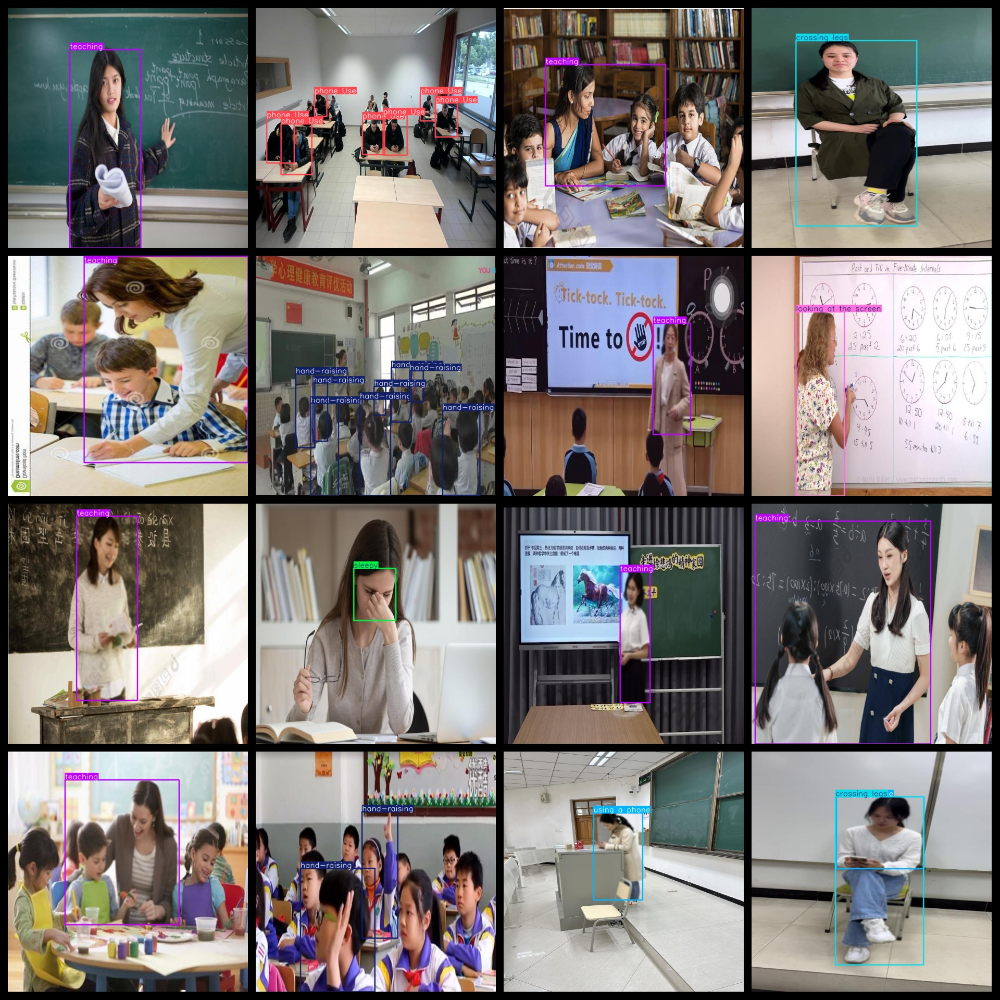
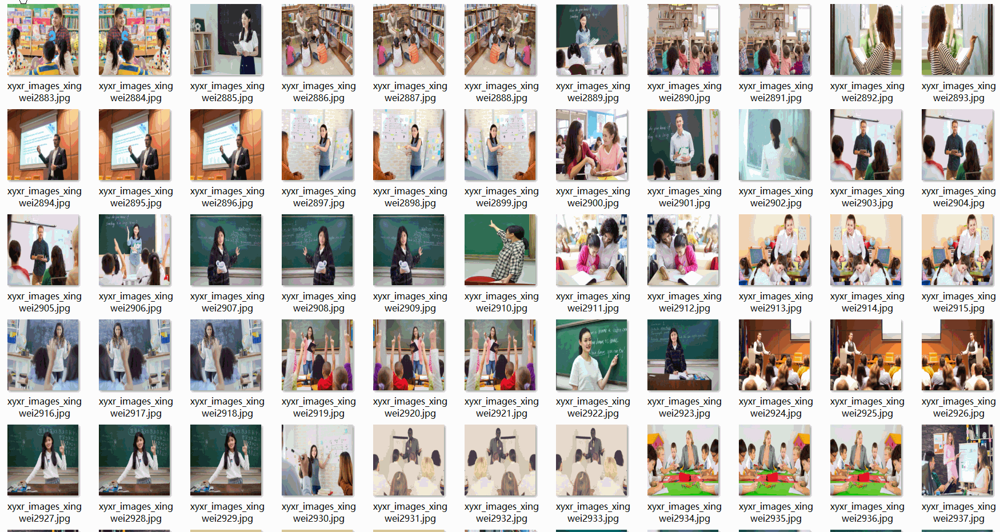

# Classroom Behavior and Status Detection Dataset 11697 imagesVOC+YOLO format

The dataset of classroom behavior and state detection includes 11697 images in the format of VOC+YOLO.

Dataset format: Pascal VOC format + YOLO format (the txt file does not contain the split path, it only contains jpg images and corresponding VOC format xml files and yolo format txt files)

Number of images (jpg file count): 11697

Number of xml files: 11697

Number of txt files: 11697

Number of categories: 12

The Github repository is: datasets_sl

["attentive", "crossing legs", "daydreaming", "distracted", "hand-raising", "looking at the screen", "phone Use", "reading", "sleepy", "teaching", "using a phone", "writing"]

Focused, "Kicking two legs," daydreaming, "not paying attention," raising hands, "looking at the screen," using a mobile phone, reading, "feeling sleepy," teaching, "using a mobile phone," writing.

Number of boxes labeled in each category:

attentive frame count = 4508

Crossing legs Frame Count = 2820

daydreaming frame count = 16

distracted frame count = 2617

hand-raising frame count = 3516

looking at the screen frame count = 682

Phone Use Frame Count = 1057

The number of readings is equal to 3159.

sleepy frame count = 640

Teaching frames = 2836

using a phone frame count = 2966

writing frame count = 711

Total frames: 25,528

Number of images per category:

Attentiveness = 443

crossing legs annotated images = 2817

Daydreaming occupies a picture count = 16

Distracted occupancy = 440

Hand-raising count = 1276

Looking at the screen, the number of images occupied by 682.

phone Use annotated images = 212

Reading the image count = 540

sleepy annotated images = 360

Teaching occupancy of picture count = 2833

Using a phone to possess 2956 images

Owning the number of pictures = 711

Image resolution: 640x640

Use the labeling tool: labelImg

Dataset Augmentation: Yes

Rules for annotation: Draw a rectangle around the category.

Important note: The dataset does not have been divided into training, validation, and testing sets.

Special Disclaimer: This dataset does not guarantee the accuracy of the trained models or weight files.

Annotation and image details are as follows:

Annotation and image details are as follows:

## Images

---

Here is a pay link on Stripe (https://buy.stripe.com/3cs8yP7sY87d0vu9AB). Please contact me lonlonago@foxmail.com after funding $89, and I will send you a complete data files, thank you!

